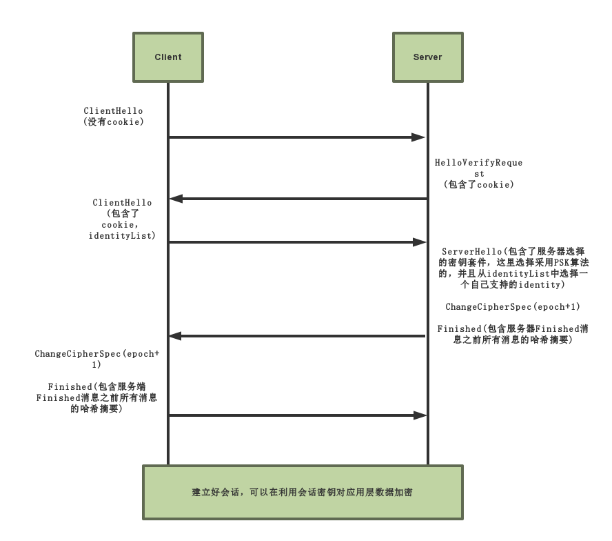

# 用于测试比对的数据

### 完整的Scandium项目
- 代码规模
    - 总体：792 KB
    - auth：17.3 KB
    - config：35.7 KB
    - dtls：560 KB
    - DTLSConnector：76 KB
    
- 交互报文
    
    消息报文数量：10~15个
    
### 只使用PSK的Scandium项目
- 代码规模
    - 总体：690 KB
    - auth：6.83 KB
    - config：35.0 KB
    - dtls：469 KB
    - DTLSConnector：75.7 KB
    
- 交互报文

    
    消息报文数量：10个
    
    采用的哈希摘要算法是SHA-256
    
### 使用轻量级PSK的Scandium项目
- 代码规模
    - 总体：663 KB
    - auth：6.83 KB
    - config：35.0 KB
    - dtls：435 KB
    - DTLSConnector：58.4 KB

- 交互报文

    
    消息报文数量：8个
    